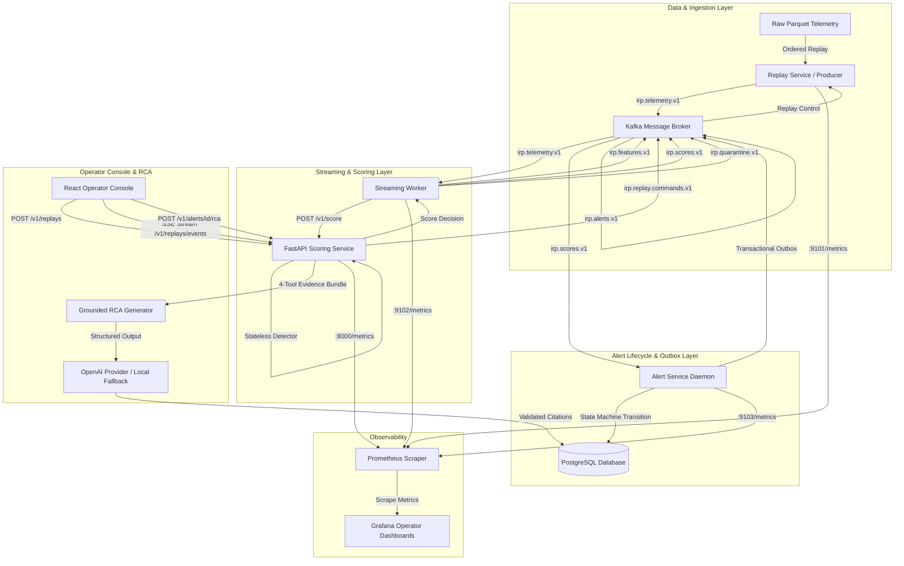

# System Architecture & Component Diagrams

---

## Data Flow Sequences

1. **Replay Ingestion & Control:** API emits control commands to `irp.replay.commands.v1`. Replay Service reads source Parquet and emits timestamp-ordered `TelemetryEventV1` messages to `irp.telemetry.v1`.
2. **Online Feature Computation:** Streaming worker consumes raw telemetry, constructs rolling causal windows, catches segment breaks, and routes malformed records to `irp.quarantine.v1`.
3. **Stateless Anomaly Scoring:** Streaming worker sends `FeatureVectorV1` to FastAPI `/v1/score`, which evaluates the candidate model and returns `ScoreDecisionV1` published to `irp.scores.v1`.
4. **Alert State Machine & Outbox:** Dedicated `AlertService` consumes score decisions, evaluates locked alert persistence/cooldown policies, transitions alert state records in PostgreSQL, and dispatches outbox alert events to `irp.alerts.v1`.
5. **Grounded RCA Generation:** On operator request, the platform projects a deterministic 4-tool evidence bundle, validates closed-world citations via OpenAI structured outputs (or graceful local fallback under outage), and writes an immutable report to PostgreSQL.
