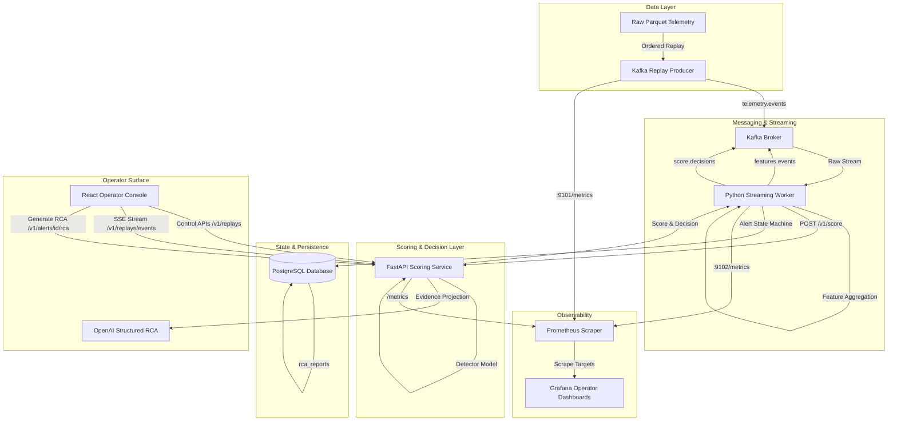

# System Architecture & Component Diagrams

---

## Data Flow Sequences

1. **Replay Ingestion:** Replay Producer reads source Parquet files and emits timestamp-ordered `TelemetryEventV1` messages to Kafka topic `irp.telemetry.events`.
2. **Online Feature Computation:** Streaming worker consumes raw telemetry, builds 5-minute bins and 30-minute rolling causal windows, and detects sequence breaks.
3. **Stateless Anomaly Scoring:** Streaming worker sends `FeatureVectorV1` to FastAPI `/v1/score`, which evaluates the champion model and returns a `ScoreDecisionV1`.
4. **Alert State Machine & Persistence:** Streaming worker transitions alert states (`OPEN`, `ACKNOWLEDGED`, `RESOLVED`) based on locked policy, storing decisions and alerts in PostgreSQL.
5. **Grounded RCA Generation:** When requested via the console or API, the platform gathers a deterministic 4-tool evidence bundle, invokes OpenAI `responses.parse`, validates citations, and persists immutable `COMPLETE` reports.
